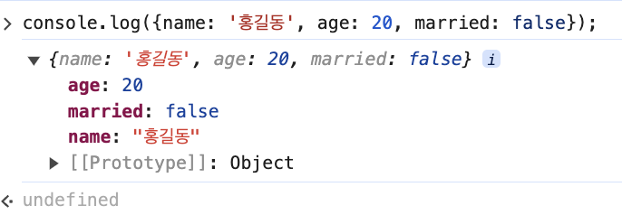

console.log(  로그에_출력할_값  );

console.log(  값1, 값2, 값3...  );
이렇게 console.log를 적고 값을 () 안에 넣어주면 된다.

### 실행을 시켜보자.
<code>console.log('Hello World!'); // Hello World!
console.log(1); // 1
console.log(true); // true
console.log({name: '홍길동', age: 20, married: false});  // 객체라고  불린다 그러면 값은 
이렇게 객체로 잘 나오는 것이 보인다.
console.log('Hi!', 100, true, [1, 2, 3]); // 이렇게 여러개로 넣으면 차례대로 나오는 것이 보인다.</code>
***************
### console 이란 무엇일까?
자바스크립트의 기능이 아니라 <em>환경</em> 의기능이다.
그리고 소프트웨어 외적으로는 영향을 끼치지 않는다. console은 사용자가 아닌, 개발자를 위해 만들어 진 것이다.

### 흔히 활용되는 console 기능들
<code>console.log('로그 - 기본적인 출력'); </code>
<code>console.info('로그 - 기능적으로는 log와 같음. 사용하기에 따라 용도 구분 가능');</code>
<code>console.warn('경고 - 문제가 될 수 있는 부분');</code>
<code>console.error('오류 - 에러 발생 상황');</code>

더 많은 기능들이 있지만, mdn을 참고하면 된다.